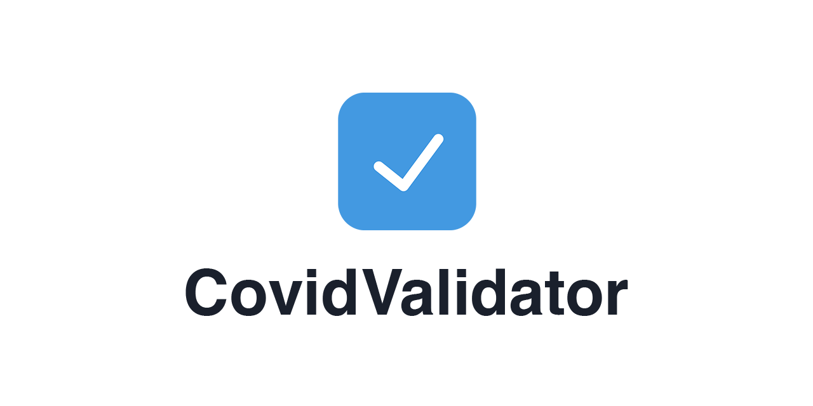

<div align="center">

 [](https://github.com/timokoenig/covid-validator/issues)  

</div>

Check EU Digitial Covid Certificates with ease and validate them against local or country rules.

**Features**

- 📱 Scan and verify EU Digital Covid Certificates
- 🌍 Validate against country or local rules
- 🎟 Scan Counter to keep track of admission criteria at local venues
- 📴 Works offline on smartphones, tablets, and desktop computers

### What is the purpose of CovidValidator?

**CovidValidator** allows you to scan and validate EU Digital Covid Certificates based on country or local rules. It gives the person that checks the certificate only as little personal information as possible to protect the users' privacy. This web app is an alternative to other existing products because it does not rely on certain app stores or country restrictions.

### Add CovidValidator to your Home Screen

Adding the **CovidValidator** to your Home Screen allows you fast access whenever you need it.

1. Open **CovidValidator** in the browser of your device (Smartphone, Tablet, Desktop)
2. Open the browsers settings or share dialog (Safari)
3. Scroll Down and tap **Add to Home Screen**
4. Confirm Selection

### What rules are being used?

The app uses the official [EU DCC Validation Rules](#eu-dcc-validation-rules) to validate the certificate. These rules are being provided by the member countries of the Digital Covid Certificate. It is a known problem that those rules might be out of date and do not reflect state or local regulations. This project adds additional rules, like state rules for Germany, to provide the verifier with more up-to-date rules.

## EU Digital Covid Certificate

A [EU Digital Covid Certificate](https://ec.europa.eu/info/live-work-travel-eu/coronavirus-response/safe-covid-19-vaccines-europeans/eu-digital-covid-certificate_en) (**EU DCC**) is a digital proof that a person has been vaccinated against COVID-19, has recovered from COVID-19 or has a test result. Therefore, the EU Digital COVID Certificate refers collectively to 3 types of certificates: vaccination, recovery and test. ([ref](https://ec.europa.eu/health/ehealth-digital-health-and-care/ehealth-and-covid-19_en))

**Key features of the certificate** ([ref](https://ec.europa.eu/info/live-work-travel-eu/coronavirus-response/safe-covid-19-vaccines-europeans/eu-digital-covid-certificate_en))

- Digital and/or paper format
- with QR code
- free of charge
- in national language and English
- safe and secure
- valid in all EU countries

### Signature Verification

The QR code on every certificate has a digital signature to protect it against falsification and it is being checked every time the QR code is scanned. Those signatures are being created by issuing entities, like hospitals, test centers, and health authorities. The public keys are shared through a European gateway with the member countries. The countries then provide additional software to allow the download of those keys. Read more about the update flow [here](https://github.com/Digitaler-Impfnachweis/certification-apis/blob/master/dsc-update/README.md).

**CovidValidation** uses a Github Action to fetch the newest DSC list once a day from the following API. The reason to do this not in the app itself is to minimize the risk of failed requests and reduce the load on the API.

- API: [de.dscg.ubirch.com](https://de.dscg.ubirch.com/trustList/DSC/)
- Data Schema: [github.com/Digitaler-Impfnachweis/certification-apis](https://github.com/Digitaler-Impfnachweis/certification-apis/blob/master/dsc-update/README.md#data-schema)

The verification takes place in `async function verifyDCC(dcc: DCC): Promise<boolean>` ([link](https://github.com/timokoenig/covid-validator/blob/bbf92a6df5ad56463d8e6fd47190ed4a1f023b3a/utils/dcc.ts#L219)). Every time a certificate is scanned, the app checks for the _kid_ in the CBOR Web Token and searches for the matching DSC. If no _kid_ is available, then all DSCs will be used to verify the certificate. The app uses [cose-js](https://github.com/erdtman/COSE-JS) to verify the signature of the DCC. If the check fails, the user will get an error message that the certificate is technically invalid. Any manipulation of the payload of the DCC will result in an invalid certificate due to the siganture check.

**More Information**

- [Technical Specifications for Digital Green Certificates](https://ec.europa.eu/health/system/files/2021-04/digital-green-certificates_v1_en_0.pdf)
- [CBOR Object Signing and Encryption](https://datatracker.ietf.org/doc/html/draft-ietf-cose-msg)
- [DCC Schema](https://github.com/ehn-dcc-development/ehn-dcc-schema)

### Test Data

You can find a repository with demo certificates [here](https://github.com/eu-digital-green-certificates/dcc-quality-assurance).

The app will validate only production certificates by default. If you want to use these demo certificates set the following ENV var:

```bash
NEXT_PUBLIC_DEBUG_DSC=true
```

## EU DCC Validation Rules

The [EU DCC Validation Rules](https://ec.europa.eu/health/system/files/2021-06/eu-dcc_validation-rules_en_0.pdf) allow a verifier to check if a DCC holder fulfills all requirements to enter a country. You, as a verifier, can change the rules by selecting a different country in the app. Always make sure to select the rules that are required by law in your country, otherwise the verification results might be invalid.

**CovidValidation** uses a Github Action to fetch the newest rules and value sets once a day from the EU Digital COVID Certificate Business Rule Service. The reason to do this not in the app itself is to minimize the risk of failed requests and reduce the load on the API.

- API: [distribution.dcc-rules.de](https://distribution.dcc-rules.de)
- OpenAPI Specs: [eu-digital-green-certificates.github.io/dgca-businessrule-service](https://eu-digital-green-certificates.github.io/dgca-businessrule-service/)
- Overview of current rules: [EU DCC Rules](https://timokoenig.github.io/eu-dcc-rules/)

For reference implementations, please refer to [github.com/ehn-dcc-development/dgc-business-rules](https://github.com/ehn-dcc-development/dgc-business-rules).

The DGCA Business Rule Service is provided by T-Systems Internation GmbH under the [Apache License, Version 2.0](https://www.apache.org/licenses/LICENSE-2.0).

## Custom Rule Builder

The custom rule builder allows you to create your own rule set if the available rules do not meet your requirements. This feature is currently in **BETA** and it might occur problems, so please use it with caution. Nevertheless this does not affect the **CovidValidator** with all country and state rules!

**NOTE** Documentation will follow shortly

## Getting Started

Add the following variables to your _.env_ file:

```sh
NEXT_PUBLIC_CONTACT_NAME=xxx
NEXT_PUBLIC_CONTACT_ADDRESS=xxx
NEXT_PUBLIC_CONTACT_ADDRESS_CITY=xxx
NEXT_PUBLIC_CONTACT_ADDRESS_COUNTRY=xxx
NEXT_PUBLIC_CONTACT_EMAIL=xxx
NEXT_PUBLIC_CONTACT_WEBSITE=covidvalidator.app
NEXT_PUBLIC_VERSION=0.0.1
```

Then run the following two commands to start your local server:

```sh
npm install
npm run dev
```

## Developer Notes

The QR code reader needs to run over localhost or SSL to work. For the local development, follow [these steps](https://github.com/vercel/next.js/discussions/10935#discussioncomment-1540436) and run `ipconfig getifaddr en0` to get your IP address. Now you can access your dev build via HTTPS on your network.

## i18n

The app uses [i18next](https://www.i18next.com/) for internationalization. We want to offer this app to as many people as possible therefore native translations are important. We welcome anyone to help us translate this app. To do so, follow these steps:

1. If the language does not exist, create a folder in _/translations_ and copy the files _/translations/en/common.json_ and _/translations/en/country.json_ in that folder
2. Translate the existing values in those files and make sure you do not change the key
3. In case of a new language, please follow the next three steps, otherwise jump to _4)_
   a) Add the translation for the new language to the other _common.json_ files
   b) Add the language key to the `const availableLanguages = ['en', 'de']` array in _components/modal/settings.tsx_
   c) Add the i18next resource to `pages/_app.tsx` similar to the other languages
4. Save and commit your changes

Note: If you do not add a translation in any given language, the app will default to English.

### Available Languages

- English (100%)
- German (100%)
- Lithuanian (85%, further checks required)

## More Information

- [A collection of Country and State rules](./docs/README.md).

---

<p align="center">Made with <span style="color: red">♥</span> for the community</p>
